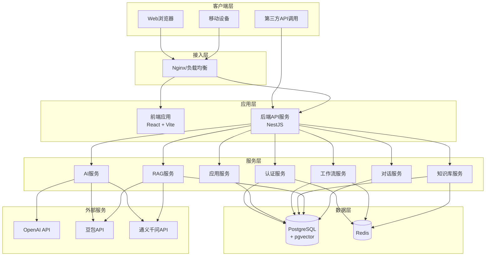
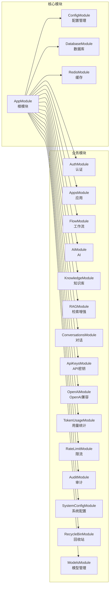

# AI低代码平台运维文档

## 文档信息

| 项目 | 内容 |
|------|------|
| 文档名称 | AI低代码平台运维文档 |
| 版本号 | v1.0.0 |
| 创建日期 | 2026-04-30 |
| 最后更新 | 2026-04-30 |
| 维护人员 | 运维团队 |

---

## 目录

- [1. 系统概述](#1-系统概述)
- [2. 系统架构](#2-系统架构)
- [3. 环境要求](#3-环境要求)
- [4. 环境搭建](#4-环境搭建)
- [5. 日常维护](#5-日常维护)
- [6. 常见问题](#6-常见问题)
- [7. 更新记录](#7-更新记录)

---

## 1. 系统概述

AI低代码平台是一个基于AI的低代码应用构建平台，支持可视化工作流编排、知识库管理、AI对话等功能。

### 1.1 主要功能

- 可视化工作流编排
- AI对话与集成
- 知识库管理（RAG）
- 用户认证与权限管理
- API开放平台
- 审计日志
- 模型管理

### 1.2 技术栈

#### 后端
- **框架**: NestJS 11.x
- **语言**: TypeScript
- **数据库**: PostgreSQL 18 + pgvector
- **缓存**: Redis 7
- **AI集成**: OpenAI SDK、豆包API、通义千问API
- **ORM**: TypeORM
- **认证**: JWT + Passport
- **文档**: Swagger

#### 前端
- **框架**: React 19
- **构建工具**: Vite
- **UI组件**: ShadCN UI + Tailwind CSS
- **状态管理**: Zustand
- **工作流**: ReactFlow
- **路由**: React Router

#### 部署
- **容器化**: Docker
- **编排**: Docker Compose

---

## 2. 系统架构

### 2.1 整体架构图



### 2.2 后端模块架构



### 2.3 服务依赖关系

| 服务 | 依赖 | 说明 |
|------|------|------|
| API服务 | PostgreSQL、Redis | 主应用服务 |
| PostgreSQL | - | 主数据库，存储业务数据和向量 |
| Redis | - | 缓存、会话、限流 |

---

## 3. 环境要求

### 3.1 硬件要求

#### 开发环境
| 资源 | 最低配置 | 推荐配置 |
|------|----------|----------|
| CPU | 2核 | 4核+ |
| 内存 | 4GB | 8GB+ |
| 磁盘 | 20GB | 50GB+ |

#### 测试环境
| 资源 | 最低配置 | 推荐配置 |
|------|----------|----------|
| CPU | 4核 | 8核+ |
| 内存 | 8GB | 16GB+ |
| 磁盘 | 50GB | 100GB+ |

#### 生产环境
| 资源 | 最低配置 | 推荐配置 |
|------|----------|----------|
| CPU | 8核 | 16核+ |
| 内存 | 16GB | 32GB+ |
| 磁盘 | 100GB | 500GB+ (SSD) |

### 3.2 软件要求

| 软件 | 版本要求 | 说明 |
|------|----------|------|
| Docker | 20.10+ | 容器运行时 |
| Docker Compose | 2.0+ | 容器编排 |
| Node.js | 20.x | (开发环境) |
| pnpm | 8.x+ | (开发环境) |
| Git | 最新版 | 版本控制 |

### 3.3 网络要求

- 能够访问以下外部API：
  - OpenAI API (可选)
  - 豆包API (字节跳动火山引擎)
  - 通义千问API (阿里云)
- 开放端口：3000 (API)、前端端口 (如 5173)

---

## 4. 环境搭建

### 4.1 获取代码

```bash
# 克隆代码仓库
git clone <repository-url>
cd ai-lowcode-platform
```

### 4.2 Docker Compose 部署（推荐）

#### 4.2.1 配置环境变量

复制并编辑环境变量配置文件：

```bash
cd server
cp .env.docker .env
# 编辑 .env 文件，根据需要修改配置
```

**环境变量说明**：

| 变量名 | 说明 | 默认值 |
|--------|------|--------|
| POSTGRES_USER | PostgreSQL用户名 | postgres |
| POSTGRES_PASSWORD | PostgreSQL密码 | AiLowcode123! |
| POSTGRES_DB | PostgreSQL数据库名 | ai-lowcode-platform |
| DATABASE_URL | 数据库连接字符串 | - |
| REDIS_URL | Redis连接字符串 | redis://redis:6379 |
| JWT_SECRET | JWT密钥 | 请修改 |
| JWT_ACCESS_TOKEN_EXPIRES_IN | Access Token过期时间 | 1h |
| JWT_REFRESH_TOKEN_EXPIRES_IN | Refresh Token过期时间 | 7d |
| DOUBAO_CHAT_API_KEY | 豆包Chat API Key | - |
| DOUBAO_DEFAULT_CHAT_MODEL | 豆包默认Chat模型 | doubao-seed-2-0-pro-260215 |
| DOUBAO_EMBEDDING_API_KEY | 豆包Embedding API Key | - |
| DOUBAO_DEFAULT_EMBEDDING_MODEL | 豆包默认Embedding模型 | doubao-embedding-vision-251215 |
| DASHSCOPE_CHAT_API_KEY | 通义千问Chat API Key | - |
| QWEN_DEFAULT_CHAT_MODEL | 通义千问默认Chat模型 | qvq-max-2025-03-25 |
| DASHSCOPE_EMBEDDING_API_KEY | 通义千问Embedding API Key | - |
| PORT | 服务端口 | 3000 |

#### 4.2.2 启动服务

```bash
# 进入 server 目录
cd server

# 构建并启动所有服务
docker-compose up -d --build

# 查看服务状态
docker-compose ps

# 查看日志
docker-compose logs -f
```

#### 4.2.3 验证部署

访问以下地址验证服务：

- API服务: http://localhost:3000
- API文档: http://localhost:3000/api/docs
- 健康检查: http://localhost:3000/api (应该返回服务信息)

#### 4.2.4 停止服务

```bash
# 停止服务但保留数据
docker-compose down

# 停止服务并删除数据卷（谨慎使用）
docker-compose down -v
```

### 4.3 开发环境搭建

#### 4.3.1 安装依赖

```bash
# 安装 pnpm (如果未安装)
npm install -g pnpm

# 安装后端依赖
cd server
pnpm install

# 安装前端依赖
cd ../web
pnpm install
```

#### 4.3.2 启动依赖服务

使用 Docker 启动 PostgreSQL 和 Redis：

```bash
cd server
docker-compose up -d postgres redis
```

#### 4.3.3 配置环境变量

```bash
cd server
cp .env.docker .env
# 编辑 .env 文件，将 localhost 作为数据库和 Redis 主机
```

#### 4.3.4 启动开发服务

**启动后端：**

```bash
cd server
pnpm run start:dev
```

**启动前端：**

```bash
cd web
pnpm run dev
```

#### 4.3.5 访问应用

- 前端: http://localhost:5173
- 后端API: http://localhost:3000
- API文档: http://localhost:3000/api/docs

### 4.4 生产环境部署

#### 4.4.1 准备生产环境配置

创建生产环境专用的 `.env.production` 文件：

```bash
cd server
cp .env.docker .env.production
# 编辑 .env.production，设置生产环境配置
```

**生产环境关键配置：**

- 修改 JWT_SECRET 为强密码
- 修改数据库密码
- 配置 ALLOWED_ORIGINS
- 配置生产级别的 API Key

#### 4.4.2 使用 Docker Compose 部署生产环境

创建生产环境的 docker-compose 文件：

```yaml
# docker-compose.production.yml
version: '3.8'
services:
  postgres:
    image: pgvector/pgvector:pg18
    container_name: ai-lowcode-postgres-prod
    environment:
      POSTGRES_USER: ${POSTGRES_USER}
      POSTGRES_PASSWORD: ${POSTGRES_PASSWORD}
      POSTGRES_DB: ${POSTGRES_DB}
    volumes:
      - postgres_prod_data:/var/lib/postgresql
      - ./init-db:/docker-entrypoint-initdb.d
    restart: always
    networks:
      - ai-lowcode-network
    healthcheck:
      test: ['CMD-SHELL', 'pg_isready -U ${POSTGRES_USER}']
      interval: 15s
      timeout: 10s
      retries: 10

  redis:
    image: redis:7-alpine
    container_name: ai-lowcode-redis-prod
    volumes:
      - redis_prod_data:/data
    restart: always
    networks:
      - ai-lowcode-network
    healthcheck:
      test: ['CMD', 'redis-cli', 'ping']
      interval: 10s
      timeout: 5s
      retries: 5

  api:
    image: ai-lowcode-platform:prod
    build:
      context: .
      dockerfile: Dockerfile
    container_name: ai-lowcode-api-prod
    env_file:
      - .env.production
    depends_on:
      postgres:
        condition: service_healthy
      redis:
        condition: service_healthy
    restart: always
    networks:
      - ai-lowcode-network
    healthcheck:
      test: ['CMD-SHELL', 'wget --quiet --tries=1 --spider http://localhost:${PORT} || exit 1']
      interval: 30s
      timeout: 10s
      retries: 3
      start_period: 40s

  nginx:
    image: nginx:alpine
    container_name: ai-lowcode-nginx-prod
    ports:
      - '80:80'
      - '443:443'
    volumes:
      - ./nginx.conf:/etc/nginx/nginx.conf:ro
      - ./ssl:/etc/nginx/ssl:ro
    depends_on:
      - api
    restart: always
    networks:
      - ai-lowcode-network

volumes:
  postgres_prod_data:
  redis_prod_data:

networks:
  ai-lowcode-network:
    driver: bridge
```

#### 4.4.3 部署前端

构建前端应用：

```bash
cd web
pnpm run build
```

将 `dist` 目录部署到 Nginx 或其他静态文件服务器。

---

## 5. 日常维护

### 5.1 服务管理

#### 5.1.1 查看服务状态

```bash
cd server
docker-compose ps
```

#### 5.1.2 查看服务日志

```bash
# 查看所有服务日志
docker-compose logs -f

# 查看特定服务日志
docker-compose logs -f api
docker-compose logs -f postgres
docker-compose logs -f redis
```

#### 5.1.3 重启服务

```bash
# 重启所有服务
docker-compose restart

# 重启特定服务
docker-compose restart api
```

#### 5.1.4 更新服务

```bash
# 拉取最新代码
git pull

# 重新构建并启动
docker-compose up -d --build
```

### 5.2 数据库维护

#### 5.2.1 数据库备份

```bash
# 备份 PostgreSQL 数据库
docker exec ai-lowcode-postgres pg_dump -U postgres ai-lowcode-platform > backup_$(date +%Y%m%d).sql

# 备份 Redis 数据
docker exec ai-lowcode-redis redis-cli BGSAVE
docker cp ai-lowcode-redis:/data/dump.rdb redis_backup_$(date +%Y%m%d).rdb
```

#### 5.2.2 数据库恢复

```bash
# 恢复 PostgreSQL 数据库
cat backup.sql | docker exec -i ai-lowcode-postgres psql -U postgres -d ai-lowcode-platform

# 恢复 Redis 数据
docker cp redis_backup.rdb ai-lowcode-redis:/data/dump.rdb
docker-compose restart redis
```

#### 5.2.3 清理旧数据

定期清理审计日志、API调用日志等历史数据：

```sql
-- 清理30天前的审计日志
DELETE FROM audit_log WHERE created_at < NOW() - INTERVAL '30 days';

-- 清理30天前的API调用日志
DELETE FROM api_call_log WHERE created_at < NOW() - INTERVAL '30 days';

-- 清理已删除超过30天的回收站数据
DELETE FROM recycle_bin WHERE deleted_at < NOW() - INTERVAL '30 days';
```

### 5.3 监控与健康检查

#### 5.3.1 健康检查端点

- **API健康检查**: `GET /api`
- **Swagger文档**: `GET /api/docs`

#### 5.3.2 容器健康检查

Docker Compose 已配置健康检查，可通过以下命令查看：

```bash
docker inspect --format='{{.State.Health.Status}}' ai-lowcode-api
docker inspect --format='{{.State.Health.Status}}' ai-lowcode-postgres
docker inspect --format='{{.State.Health.Status}}' ai-lowcode-redis
```

### 5.4 性能优化

#### 5.4.1 数据库优化

- 定期执行 `VACUUM ANALYZE`
- 监控慢查询日志
- 为常用查询添加索引

#### 5.4.2 Redis 优化

- 设置合理的过期时间
- 监控内存使用情况
- 考虑启用持久化

#### 5.4.3 应用优化

- 启用 Gzip 压缩
- 配置合适的缓存策略
- 监控 API 响应时间

### 5.5 安全维护

#### 5.5.1 定期更新

```bash
# 更新基础镜像
docker-compose pull

# 重新构建应用
docker-compose up -d --build
```

#### 5.5.2 安全检查

- 定期轮换 JWT_SECRET
- 定期轮换数据库密码
- 检查 API Key 使用情况
- 审查审计日志

---

## 6. 常见问题

### 6.1 服务无法启动

**问题**: API 服务无法启动，显示数据库连接失败

**解决方案**:
1. 检查 PostgreSQL 和 Redis 是否正常运行：`docker-compose ps`
2. 检查环境变量配置是否正确
3. 查看日志：`docker-compose logs api`
4. 确认数据库初始化完成

### 6.2 数据库连接问题

**问题**: 提示 "Connection refused" 或 "Connection timeout"

**解决方案**:
1. 确认 PostgreSQL 容器正在运行
2. 检查数据库连接字符串配置
3. 检查防火墙设置
4. 验证数据库用户名和密码

### 6.3 AI API 调用失败

**问题**: AI 功能无法使用，API 调用失败

**解决方案**:
1. 检查 API Key 配置是否正确
2. 确认网络连接正常，能够访问外部 API
3. 查看后端日志获取详细错误信息
4. 检查 API 配额是否充足

### 6.4 内存不足

**问题**: 容器被 OOM Killed

**解决方案**:
1. 增加服务器内存
2. 调整 Docker 资源限制
3. 优化数据库查询
4. 清理 Redis 缓存

### 6.5 磁盘空间不足

**问题**: 磁盘空间告警

**解决方案**:
1. 清理 Docker 未使用的镜像和容器：`docker system prune`
2. 清理旧的日志文件
3. 清理数据库旧数据
4. 增加磁盘空间

---

## 7. 更新记录

| 版本 | 日期 | 更新内容 | 更新人 |
|------|------|----------|--------|
| v1.0.0 | 2026-04-30 | 初始版本，包含完整的运维文档 | 运维团队 |

---

## 附录

### A. 参考资料

- [NestJS 官方文档](https://docs.nestjs.com/)
- [PostgreSQL 官方文档](https://www.postgresql.org/docs/)
- [Redis 官方文档](https://redis.io/documentation)
- [Docker 官方文档](https://docs.docker.com/)
- [React 官方文档](https://react.dev/)

### B. 联系方式

如有问题，请联系运维团队。

